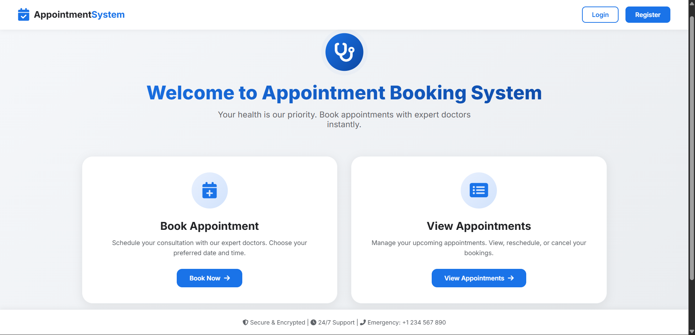
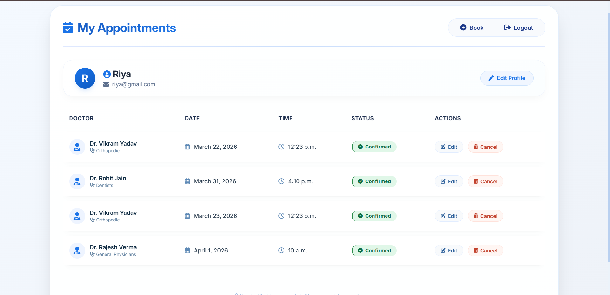

# 🏥 Appointment Booking System

A full-featured **Django web application** that allows users to register, log in, and manage doctor appointments — book, view, update, and cancel — all through a clean, template-driven interface.

---


## 📸 Screenshots
 
### 🔐 Login


### 📝 Register


### 🏠 Dashboard


### 📅 Book Appointment


### 📋 View Appointments


### ✏️ Update Appointment


## ✨ Features

### 🔐 User Authentication
- Register a new account
- Login and logout securely
- Only logged-in users can book or manage appointments

### 👨‍⚕️ Doctor Management
- Doctors have name and specialization
- Doctors are added and managed via the Django admin panel

### 📅 Appointment Booking
- Select a doctor, date, and time to book an appointment
- Prevents double-booking — same doctor + date + time cannot be booked twice

### 📋 View Appointments
- View all your appointments in a clean table
- See doctor name, specialization, date, time, and status
- Status is color-coded: **Booked = Green**, **Cancelled = Red**

### ✏️ Appointment Management
- Update (reschedule) an existing appointment
- Cancel an appointment with a confirmation popup

---

## 🛠 Tech Stack

| Layer | Technology |
|-------|-----------|
| Backend | Python 3, Django |
| Database | MySQL |
| Frontend | HTML, CSS (Django Templates) |
| Admin Panel | Django Admin |

---

## 📂 Project Structure

```
appointment-booking-system/
│
├── appointmentsystem/          # Django project config
│   ├── settings.py
│   ├── urls.py
│   └── wsgi.py
│
├── appointment/                # Main Django app
│   ├── models.py               # Doctor & Appointment models
│   ├── views.py                # Register, login, book, update, cancel
│   └── urls.py
│
│── templates/
│   ├── login.html
│   ├── register.html
│   ├── book.html
│   ├── view_appointments.html
│   ├── update,html
│   └── dashboard
│
├── screenshots/                # App screenshots for README
├── manage.py
└── README.md
```

---

## 🗄 Database Design

### Doctor Model
| Field | Type | Description |
|-------|------|-------------|
| `id` | AutoField | Primary key |
| `name` | CharField | Doctor's full name |
| `specialization` | CharField | Medical specialization |

### Appointment Model
| Field | Type | Description |
|-------|------|-------------|
| `id` | AutoField | Primary key |
| `user` | ForeignKey → User | Logged-in user who booked |
| `doctor` | ForeignKey → Doctor | Selected doctor |
| `date` | DateField | Appointment date |
| `time` | TimeField | Appointment time |
| `status` | CharField | `Booked` / `Completed` / `Cancelled` |

> **Relationships:** One User → Many Appointments. One Doctor → Many Appointments.

---

## 🚀 Installation & Setup

### 1. Clone the repository

```bash
git clone https://github.com/your-username/appointment-booking-system.git
cd appointment-booking-system
```

### 2. Create and activate a virtual environment

```bash
python -m venv venv

# Windows
venv\Scripts\activate

# Linux / Mac
source venv/bin/activate
```

### 3. Install dependencies

```bash
pip install django
```

### 4. Run migrations

```bash
python manage.py makemigrations
python manage.py migrate
```

### 5. Create a superuser (to add doctors via admin)

```bash
python manage.py createsuperuser
```

### 6. Start the development server

```bash
python manage.py runserver
```

Open [http://127.0.0.1:8000](http://127.0.0.1:8000) in your browser.

### 7. Add doctors via Admin Panel

Go to [http://127.0.0.1:8000/admin](http://127.0.0.1:8000/admin), log in with your superuser credentials, and add doctors.

---

## 🔄 How It Works

```
User registers / logs in
        ↓
Selects a doctor + date + time
        ↓
System checks for double-booking
        ↓
Appointment saved with status: Booked
        ↓
User can update (reschedule) or cancel
        ↓
Status updates to: Cancelled
```

---

## 🧠 Key Django Concepts Used

| Concept | Where Used |
|---------|-----------|
| `ForeignKey` | Appointment linked to User and Doctor |
| `on_delete=CASCADE` | Deleting a user removes their appointments |
| `choices` field | Appointment status (Booked / Completed / Cancelled) |
| Django Auth | Built-in User model for login/register |
| Django Admin | Manage doctors and appointments |
| Template rendering | All UI via Django HTML templates |
| ORM queries | `filter()`, `get()` for fetching appointments |

---

## 🔒 Business Logic

- A user can only **see their own appointments** (`filter(user=request.user)`)
- **Double booking is blocked** — same doctor + date + time raises a validation error
- **Completed appointments cannot be rescheduled** — status check in the update view
- Cancellation changes status to `Cancelled` instead of deleting the record (better for audit trails)

---

## 🚧 Upcoming Improvements

- [ ] Convert to REST API using Django REST Framework (DRF)
- [ ] Add React or Next.js frontend
- [ ] Email confirmation on booking
- [ ] Doctor availability time slot validation
- [ ] Pagination on appointments list
- [ ] Deploy to Railway / Render

---

## 👤 Author

**Samiksha Apake**

[](https://github.com/samiksha-2702)
[](https://linkedin.com/in/your-profile)

---

## 📄 License

This project is open source and available under the [MIT License](LICENSE).