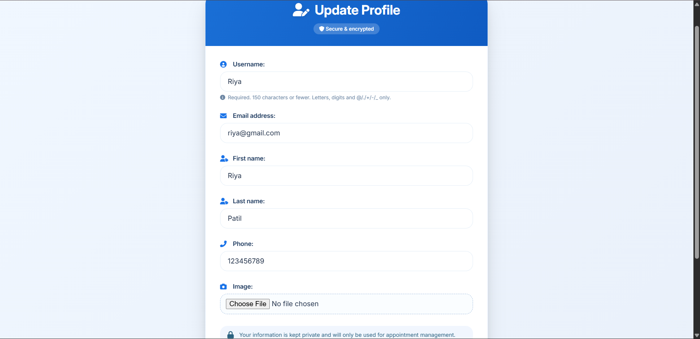
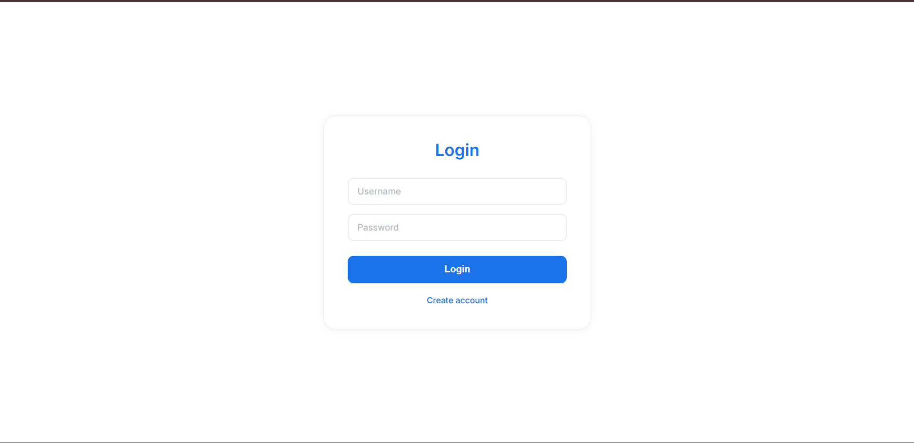
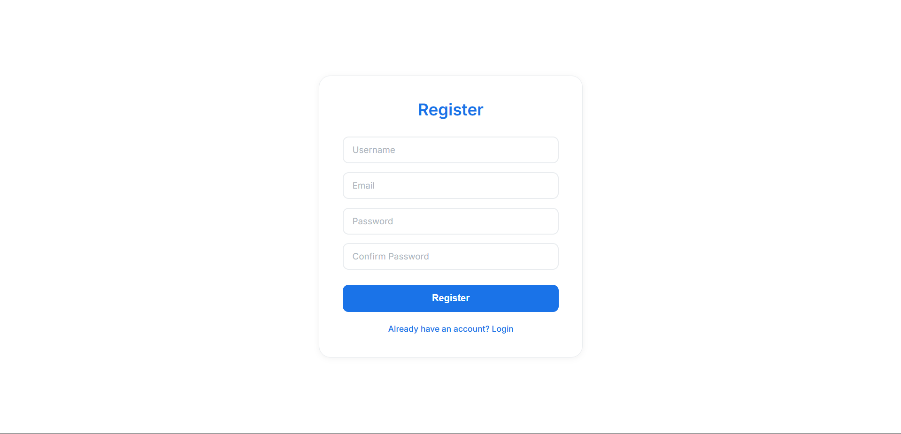
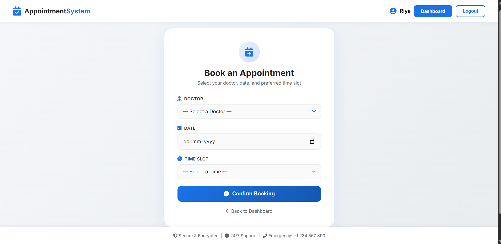
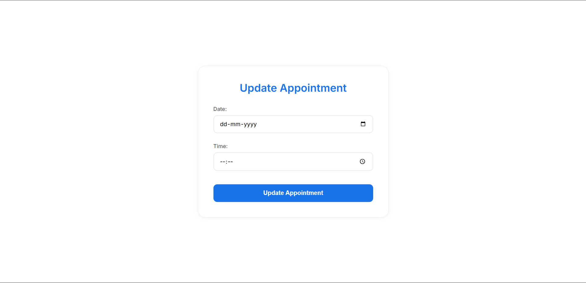

# 🏥 Appointment Booking System

A full-featured Django web application with a REST API layer (Django REST Framework) that allows users to register, log in, and manage doctor appointments — book, view, update, and cancel — through both a template-driven UI and a JSON API.

---


## 📸 Screenshots

### 🏠 Dashboard


### ✏️ Update User Profile


### 📋 View Appointments

 
### 🔐 Login


### 📝 Register


### 📅 Book Appointment


### ✏️ Update Appointment


## ✨ Features

### 🔐 User Authentication
- Register a new account
- Login and logout securely
- Only logged-in users can book or manage appointments

### 👨‍⚕️ Doctor Management
- Doctors have name and specialization
- Doctors are added and managed via the Django admin panel

### 📅 Appointment Booking
- Select a doctor, date, and time to book an appointment
- Prevents double-booking — same doctor + date + time cannot be booked twice

### 📋 View Appointments
- View all your appointments in a clean table
- See doctor name, specialization, date, time, and status
- Status is color-coded: **Booked = Green**, **Cancelled = Red**

### ✏️ Appointment Management
- Update (reschedule) an existing appointment
- Cancel an appointment with a confirmation popup
 
### 🔌 REST API (DRF)
- JSON-based API for all core resources (Doctors, Appointments)
- Session authentication support
- Browsable API via DRF's built-in interface a `/api/`

---

## 🛠 Tech Stack

| Layer | Technology |
|-------|-----------|
| Backend | Python 3, Django |
| REST API | Django REST Framework (DRF) |
| Database | MySQL |
| Frontend | HTML, CSS (Django Templates) |
| Admin Panel | Django Admin |

---

## 📂 Project Structure

```
appointment-booking-system/
│
├── appointmentsystem/          # Django project config
│   ├── settings.py
│   ├── urls.py
│   └── wsgi.py
│
├── appointment/                # Main Django app
│   ├── models.py               # Doctor & Appointment models
│   ├── views.py                # Register, login, book, update, cancel
│   ├── serializers.py          # DRF serializers for Doctor & Appointment
│   ├── api_views.py            # DRF API views (ViewSets / APIViews)
│   └── urls.py
│
│── templates/
│   ├── login.html
│   ├── register.html
│   ├── book.html
│   ├── view_appointments.html
│   ├── update,html
│   └── dashboard
│
├── screenshots/                # App screenshots for README
├── manage.py
├── requirements.txt
└── README.md
```

---

## 🔌 REST API Endpoints
 
Base URL: `http://127.0.0.1:8000/api/`
 
### 👨‍⚕️ Doctors
 
| Method | Endpoint | Description |
|---|---|---|
| `GET` | `/api/doctors/` | List all doctors |
| `GET` | `/api/doctors/<id>/` | Retrieve a specific doctor |
| `POST` | `/api/doctors/` | Create a new doctor *(admin only)* |
| `PUT` | `/api/doctors/<id>/` | Update a doctor *(admin only)* |
| `DELETE` | `/api/doctors/<id>/` | Delete a doctor *(admin only)* |
 
**Sample Response — `GET /api/doctors/`**
```json
[
  {
    "id": 1,
    "name": "Dr. Priya Sharma",
    "specialization": "Cardiologist"
  },
  {
    "id": 2,
    "name": "Dr. Rahul Mehta",
    "specialization": "Dermatologist"
  }
]
```
 
---
 
### 📅 Appointments
 
| Method | Endpoint | Description |
|---|---|---|
| `GET` | `/api/appointments/` | List all appointments for the logged-in user |
| `GET` | `/api/appointments/<id>/` | Retrieve a specific appointment |
| `POST` | `/api/appointments/` | Book a new appointment |
| `PUT` | `/api/appointments/<id>/` | Update / reschedule an appointment |
| `PATCH` | `/api/appointments/<id>/` | Partially update (e.g., cancel) |
| `DELETE` | `/api/appointments/<id>/` | Delete an appointment |
 
**Sample Request — `POST /api/appointments/`**
```json
{
  "doctor": 1,
  "date": "2026-04-15",
  "time": "10:30:00"
}
```
 
**Sample Response**
```json
{
  "id": 5,
  "doctor": 1,
  "doctor_name": "Dr. Priya Sharma",
  "date": "2026-04-15",
  "time": "10:30:00",
  "status": "Booked"
}
```
 
---
 
### 🔐 Authentication
 
The API uses **Django Session Authentication**. Log in via the web interface at `/login/` before calling API endpoints, or use the DRF browsable API.
 
The browsable API is available at:
```
http://127.0.0.1:8000/api/
```
 
---

## 🗄 Database Design

### Doctor Model
| Field | Type | Description |
|-------|------|-------------|
| `id` | AutoField | Primary key |
| `name` | CharField | Doctor's full name |
| `specialization` | CharField | Medical specialization |

### Appointment Model
| Field | Type | Description |
|-------|------|-------------|
| `id` | AutoField | Primary key |
| `user` | ForeignKey → User | Logged-in user who booked |
| `doctor` | ForeignKey → Doctor | Selected doctor |
| `date` | DateField | Appointment date |
| `time` | TimeField | Appointment time |
| `status` | CharField | `Booked` / `Completed` / `Cancelled` |

> **Relationships:** One User → Many Appointments. One Doctor → Many Appointments.

---

## 🚀 Installation & Setup

### 1. Clone the repository

```bash
git clone https://github.com/your-username/appointment-booking-system.git
cd appointment-booking-system
```

### 2. Create and activate a virtual environment

```bash
python -m venv venv

# Windows
venv\Scripts\activate

# Linux / Mac
source venv/bin/activate
```

### 3. Install dependencies

```bash
pip install django
```

### 4. Run migrations

```bash
python manage.py makemigrations
python manage.py migrate
```

### 5. Create a superuser (to add doctors via admin)

```bash
python manage.py createsuperuser
```

### 6. Start the development server

```bash
python manage.py runserver
```

Open [http://127.0.0.1:8000](http://127.0.0.1:8000) in your browser.

### 7. Add doctors via Admin Panel

Go to [http://127.0.0.1:8000/admin](http://127.0.0.1:8000/admin), log in with your superuser credentials, and add doctors.

---

## 🔄 How It Works

```
User registers / logs in
        ↓
Selects a doctor + date + time
(via Web UI or REST API)
        ↓
System checks for double-booking
        ↓
Appointment saved with status: Booked
        ↓
User can update (reschedule) or cancel
        ↓
Status updates to: Cancelled
```

---

## 🧠 Key Django Concepts Used

| Concept | Where Used |
|---------|-----------|
| `ForeignKey` | Appointment linked to User and Doctor |
| `on_delete=CASCADE` | Deleting a user removes their appointments |
| `choices` field | Appointment status (Booked / Completed / Cancelled) |
| Django Auth | Built-in User model for login/register |
| Django Admin | Manage doctors and appointments |
| Template rendering | All UI via Django HTML templates |
| ORM queries | `filter()`, `get()` for fetching appointments |
| DRF `ModelSerializer` | Serializes Doctor and Appointment models to JSON |
| DRF `ViewSet` / `APIView` | Exposes REST endpoints for CRUD operations |
| DRF Router | Auto-generates URL patterns for ViewSets |
| Session Authentication | Shared auth between web UI and API |


---

## 🔒 Business Logic

- A user can only **see their own appointments** (`filter(user=request.user)`)
- **Double booking is blocked** — same doctor + date + time raises a validation error
- **Completed appointments cannot be rescheduled** — status check in the update view
- Cancellation changes status to `Cancelled` instead of deleting the record (better for audit trails)

---


## 👤 Author

**Samiksha Apake**

[](https://github.com/samiksha-2702)
[](https://linkedin.com/in/your-profile)

---

## 📄 License

This project is open source and available under the [MIT License](LICENSE).
